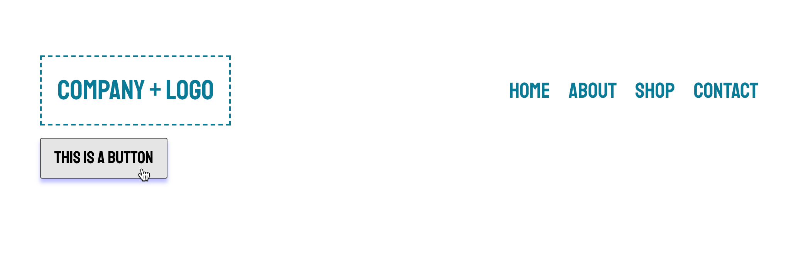
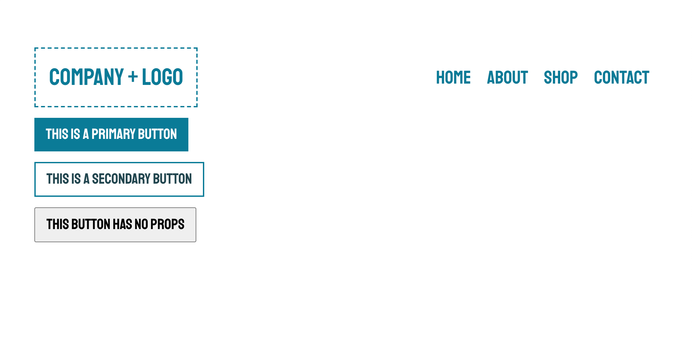
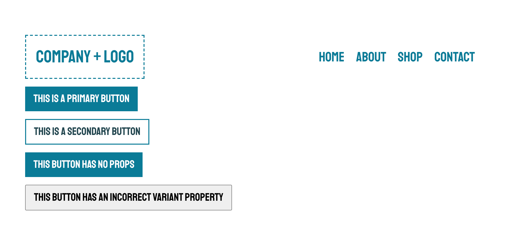
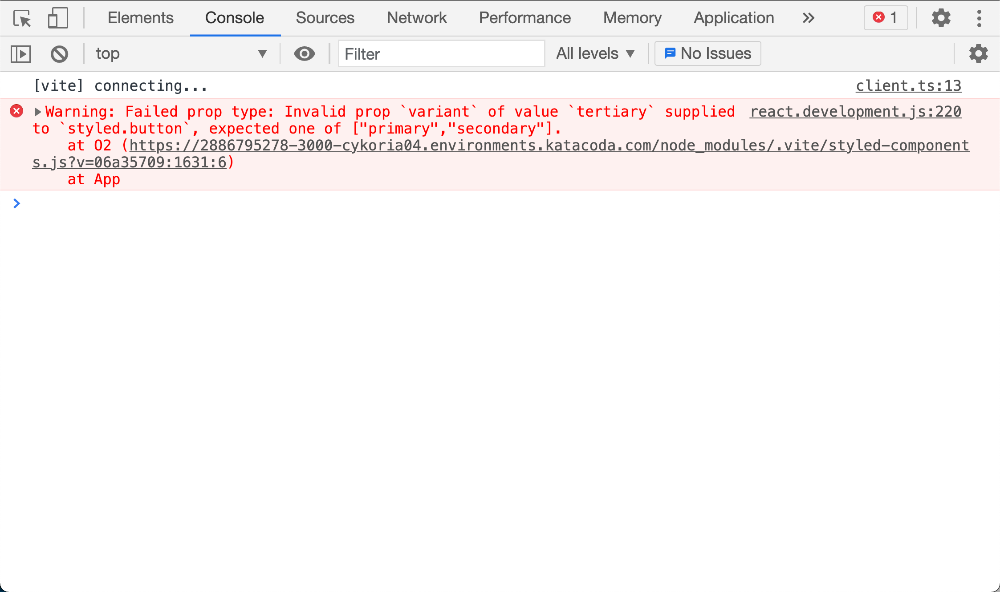
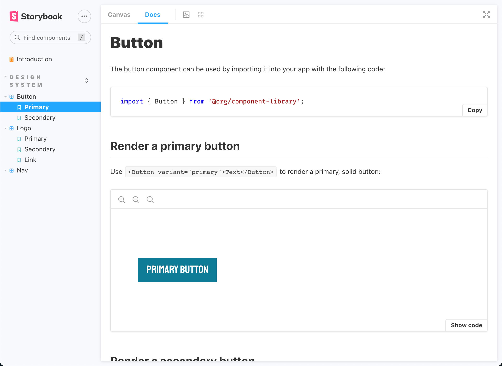

# Create and Document a React UI Component

Take [this lesson in Katacoda](https://www.katacoda.com/alexrosenkranz/scenarios/ui-component-docs) for an interactive experience!

## Introduction

In this lesson, we're going to inherit a UI component library built with React, styled-components, PropTypes, and Storybook, and step through how to build and document a React UI component so other developers know how to use it.

Ensuring that a UI component is used properly is important if the component library is to be utilized by a cross-functional development team or throughout the open source community.

This lesson assumes that you have working knowledge of JavaScript, React, CSS-in-JS technologies, and that you know how Storybook is configured. You don't have to be an expert to get through this scenario, as we'll learn particulars along the way! If you've never set up Storybook before, check out the [Storybook documentation](https://storybook.js.org/docs/react/get-started/introduction) and see how a project is configured.

## Learning Objectives

In this lesson, we will accomplish the following tasks:

* Build a UI component using styled-components and React.

* Add variant styles to a UI component.

* Integrate prop validation and default prop values using the PropTypes library.

* Document how to use a UI component with Storybook and MDX.

Walk through this lesson using the [Katacoda Scenario](https://www.katacoda.com/alexrosenkranz/scenarios/ui-component-docs), or follow along below.

If you are following along below, please clone this repository and checkout to the `start` branch before beginning.
## Step 1: Create Button Component

If you haven't, clone the repo and checkout to the `start` branch, then install the dependencies with these commands:

```bash
git clone https://github.com/arosenkranz/component-library-demo
cd component-library-demo
git fetch && git checkout start
npm i
```

### Build the Component

Once everything is installed, create a folder called `Button` in the `components` folder with a file called `index.jsx` in it. You can run the following command from the command line to do so:

```bash
mkdir ./src/components/Button && touch ./src/components/Button/index.jsx
```

Open the newly created `Button/index.jsx` file in your IDE and add the following code to import dependencies:

```jsx
import React from 'react';
import styled, { css } from 'styled-components';
import { theme, typeScale, primaryFont } from '../../utils';
```

Now let's set up our Button component's default styles. Add the following code into `Button/index.jsx` below the imports:

```jsx
export const Button = styled.button`
  border-radius: none;
  display: inline-block;
  min-width: 75px;
  cursor: pointer;
  font-family: ${primaryFont};
  text-decoration: none;
  transition: all 0.2s ease-in-out;
  padding: 12px 16px;
  font-size: ${typeScale.header5};

  &:hover {
    box-shadow: 0 5px 5px rgba(0, 0, 255, 0.25);
  }

  &:focus {
    outline: 2px solid ${theme.button.primary.bgHover};
    outline-offset: 2px;
  }
`;
```

Here we use the tagged template function, `styled.button`, to define our `Button` component and apply styles for its default, hover, and focus states.

### Test Component in App

Let's see how our Button looks! First open the `./src/App.jsx` file. Then import the Button component into the file with the following line:

```js
import { Button } from './components/Button';
```

Now let's include a Button into our JSX with the following code going below the closing `</Header>` tag:

```jsx
<div style={{ margin: '16px 0' }}>
  <Button onClick={() => alert('clicked!')}>This is a button</Button>
</div>
```

In this component, we pass an `onClick` event handler to our component, as we normally do with most buttons in React. 

Now let's test it out and see it in action! Run the following command to start the development server:

```bash
npm run dev
```

Now open the [main site](http://localhost:3000) in your browser.

As we can see, our new component has joined the components we've inherited and is rendered to the page. The page should look something like the following image:



> **Tip:** If you want to use this component as a hyperlink, do so with something like `<Button as='a' href="#">I'm a link!</Button>` and render it as an anchor element!

In the next step, we'll take this component further and add variants to help distinguish different UI styles and states.

Let's take a quick knowledge check:

**Question: How would we create a styled `h1` element with styled-components?**

1. styled(h1)``

2. styled.h1``

3. withComponent(h1)

4. h1``

<summary>Click to see the answer!</summary>
<details>
  <strong>styled.h1``</strong>
  <p>Yes! The <code>styled</code> object allows us to create a styled-component for any HTML element.</p>
</details>

---

## Step 2: Add Button Variations

In this step, we're going to extend upon this component by accepting props that will dictate the style the button appears in.

### Add Primary and Secondary Variants

Let's define what types of variants we'll have. Add the following code below the import statements in `Button/index.jsx`:

```jsx
const BTN_VARIANTS = {
  PRIMARY: 'primary',
  SECONDARY: 'secondary',
};
```

Let's now define styles for our variants by checking prop values using JavaScript. Add the following code into the `Button` definition right under the defined styles:

```jsx
${(props) => {
    if (props.variant === BTN_VARIANTS.PRIMARY) {
      return css`
        background-color: ${theme.button.primary.bg};
        border: 1px solid ${theme.button.primary.bg};
        color: ${theme.button.primary.text};
        &:hover {
          background-color: ${theme.button.primary.bgHover};
          color: ${theme.button.primary.textHover};
        }
      `;
    } else if (props.variant === BTN_VARIANTS.SECONDARY) {
      return css`
        background-color: ${theme.button.secondary.bg};
        color: ${theme.button.secondary.text};
        border: 2px solid ${theme.button.secondary.border};
        &:hover {
          background-color: ${theme.button.secondary.bgHover};
          color: ${theme.button.secondary.textHover};
        }
      `;
    }
  }}
```

Here, we execute a function that accepts the `props` object as a parameter. This is how styled-components allows us to dynamically set styles based on prop data. Specifically, we check the `props.variant` value against our `BTN_VARIANTS` object.

Let's see how they look!

### Add to App and Test

In `./src/App.jsx`, we already have the Button component imported, so let's see how these variations look by replacing the existing `<Button>` with the following code in the returning JSX:

```jsx
<div style={{ margin: '16px 0' }}>
  <Button variant='primary'>This is a primary button</Button>
</div>
<div style={{ margin: '16px 0' }}>
  <Button variant='secondary'>This is a secondary button</Button>
</div>
<div style={{ margin: '16px 0' }}>
  <Button>This button has no props</Button>
</div>
```

Here, we provide a number of variations of the Button component so we can see how it looks with different prop values.

Now let's test it out! Run the following command to start the development server, if it isn't still running:

```bash
npm run dev
```

Now open the [main site](http://localhost:3000) in your browser.

The page should now look something like the following image:



Our Button component now renders in different styles based on passed in prop data. We should probably account for what happens if you pass in an incorrect prop, or no props at all, as that last button doesn't look too great compared to the others.

In the next step, we'll use the PropTypes library to set expected prop data and provide default prop values for our component and support the developer's experience using the component.

Let's take a quick knowledge check:

**Question: What would happen if we passed in `size="large"` as a prop if we didn't define it in our component?**

1. It will break the component because we don't explicitly mention it in our component's styles.

2. It will make the button larger.

3. It will have no effect on the component.

<summary>Click to see the answer!</summary>
<details>
  <strong>It will have no effect on the component.</strong>
  <p>As with any React component, if a listed prop isn't related to a DOM attribute or event handler, it will be ignored if the component isn't checking for it.</p>
</details>

---

## Step 3: Add Prop Validation and Defaults

Our Button component is complete, but if we want other developers to download and use this component, we should add some default values and warning messages for when an incorrect prop value is used.

### Add PropTypes

Start by opening the `Button/index.jsx` file and adding the following import statement to the top of the file:

```jsx
import PropTypes from 'prop-types';
```

Now add the following code near the bottom of the file:

```jsx
Button.propTypes = {
  children: PropTypes.node.isRequired,
  variant: PropTypes.oneOf(Object.values(BTN_VARIANTS)),
};

Button.defaultProps = {
  variant: BTN_VARIANTS.PRIMARY,
};
```

First, we set the `propTypes` property on our `Button` component to inform it what props are required and what type of data is expected. If any prop value doesn't match what we set here, the component will still render, but may look incorrect. There will also be a warning message thrown to the browser's developer console.

Next, we set the `defaultProps` property. This allows developers to call upon the Button component without having to pass certain props in and still receive an intended result.

Let's see how it all works!

## Add to App and Test

In `App.jsx`, let's add one more variation of our Button component. This time, though, we'll pass a `variant` prop value that doesn't exist in our predefined `BTN_VARIANTS` list. Add the following code below the other components:

```jsx
<div style={{ margin: '16px 0' }}>
  <Button variant='tertiary'>
    This button has an incorrect variant property
  </Button>
</div>
```

Now we have a version of almost every type of Button rendering to the page. Run the following command to start the development server, if it isn't still running:

```bash
npm run dev
```

Open the [main site](http://localhost:3000) in your browser.

Now we don't need to pass any `variant` props at all and still get a nice-looking button rendered to the page, as the next image shows:



Notice the one at the bottom with the incorrect `variant` prop value passed in? It doesn't break the application, but it does throw a warning to the developer console, as can be seen in the following image:



The work we did here adds a lot to a developer's experience if they are to use this component library in their own project. Not only can they do less work because of the default props set up, they can also debug any errors by checking for a mismatched prop value.

Let's take this a step further and actually create documentation for this component!

In the next step, we'll use Storybook and write documentation for our new UI component using MDX.

Let's take a quick knowledge check:

**Question: True or False. We can add PropTypes to any React component and not just ones built with styled-components.**

1. True

2. False

<summary>Click to see the answer!</summary>
<details>
  <strong>True</strong>
  <p>We can use PropTypes on any React component! As a matter of fact, it used to be shipped with React.</p>
</details>

---

## Step 4: Component Documentation

In this final step, we're going to add documentation for the Button component we just created, allowing developers to identify how to properly use it.

Storybook is the tool we'll be using for the documentation, as it specializes in documenting these types of libraries.

### Set Up Documentation

First thing we need to do is create a file to hold our documentation for Storybook. Either use VSCode to create a file in the `Button` directory called `Button.stories.mdx` or run this command:

```bash
touch ./src/components/Button/Button.stories.mdx
```

If you're unfamiliar with MDX, that's okay. All we need to know is it allows us to combine the text formatting of Markdown and functionality of a React component using JSX! Open the file in your IDE.

In this file, let's import our dependencies. Select this code to place it into the file:

```jsx
import { Meta, Story, Preview } from '@storybook/addon-docs/blocks';

import { Button } from './index';
```

Then let's set up some information about the page so Storybook knows what it's all about. Add the following code:

```md
<Meta title='Design System/Button' component={Button} />

export const Template = (args) => <Button {...args} />;

# Button

The button component can be used by importing it into your app with the following code:

      ```js
      import { Button } from '@org/component-library';
      ```
```

Here, we use the Storybook `Meta` component to define the title of this page in the documentation and provide context as to what component we're documenting.

We also export our component as a variable called `Template`. We'll see how this is used next, but it essentially allows Storybook to bind prop data to our component so it can be updated in real-time!

We then begin our documentation by explaining to the user what this component is and how to import it.

> **Tip:** You can install the [MDX extension](https://marketplace.visualstudio.com/items?itemName=silvenon.mdx) from the VSCode marketplace for syntax highlighting in MDX files.

### Create Stories

Each defined use of a component in Storybook is known as a "Story". Using stories helps demonstrate how the component can be used with certain props.

Add the following Story definitions to the file with this code and we'll be done with our documentation:

```md
## Render a primary button

Use `<Button variant="primary">Text</Button>` to render a primary, solid button:

<Preview withToolbar>
  <Story
    name='Primary'
    args={{
      variant: 'primary',
      children: 'Primary Button',
      onClick: () => alert('this button was clicked'),
    }}
    argTypes={{
      variant: {
        name: 'Variant',
        description: 'Render different variants of the Button',
        control: {
          type: 'select',
          options: ['primary', 'secondary'],
        },
      },
    }}
  >
    {Template.bind({})}
  </Story>
</Preview>

## Render a secondary button

Use `<Button variant="secondary">Text</Button>` to render a secondary, outlined button. This can be used to create contrast and help distinguish actions a user can take when compared to a primary button.

<Preview withToolbar>
  <Story
    name='Secondary'
    args={{
      variant: 'secondary',
      children: 'Secondary Button',
      onClick: () => alert('this button was clicked'),
    }}
    argTypes={{
      variant: {
        name: 'Variant',
        description: 'Render different variants of the Button',
        control: {
          type: 'select',
          options: ['primary', 'secondary'],
        },
      },
    }}
  >
    {Template.bind({})}
  </Story>
</Preview>
```

Here, we pass in some default prop data as `args` and we also instruct Storybook how to handle some of the prop data in `argTypes`. 

The `Template.bind({})` function will take all of the context added to the `Story` component and pass it down into the rendered Button.

These will show users how to render a Primary and Secondary button and what they actually look like on a page.

Now let's see how it all looks.

Because this is running through Storybook, we are going to run this different command instead:

```bash
npm run storybook
```

> **Note:** You may be asked to correct the command `storybook`. Just enter `n` for "no".

Navigate to the documentation by visiting [http://localhost:6006](http://localhost:6006) in the browser. The resulting page should list all of the defined components, including our Button, as the following image shows:



Explore a little bit and get familiar with Storybook. Use the **Docs** tab in Storybook to see all of the documentation we've written at once, including the table of possible prop argument values.

We can even switch to the **Canvas** tab in Storybook, which allows us to update the props for a component in real-time and let us preview on the fly!

Now our Button has been built and documented, allowing other developers to learn how to use it. Great work! 

Let's recap everything we learned on the following page. But first, let's take one final knowledge check:

**Question: What Storybook component allows us to name and organize our component's documentation for users?**

1. Preview

2. Story

3. Meta

4. ArgsTable

<summary>Click to see the answer!</summary>
<details>
  <strong>Meta</strong>
  <p>Yes! We can use the <code>&lt;Meta&gt;</code> component to provide context about our component so Storybook can display it in the correct place with the correct data.</p>
</details>

## Wrapping Up

Let's recap what we accomplished in this lesson: 

* We built a UI component using styled-components and React.

* We added variant styles to a UI component.

* We integrated prop validation and default prop values using the PropTypes library.

* We documented how to use a UI component with Storybook and MDX.

## Resources

Interested in learning more about this project? Check out these resources:

* [Katacoda Scenario](https://www.katacoda.com/alexrosenkranz/scenarios/ui-component-docs)

* [Katacoda Scenario Repo](https://github.com/arosenkranz/scenarios/tree/main/ui-component-docs)

* [Project code repository](https://github.com/arosenkranz/component-library-demo)

* [React web site](https://reactjs.org/)

* [styled-components web site](https://styled-components.com/)

* [PropTypes GitHub repository](https://github.com/facebook/prop-types)

* [Storybook web site](https://storybook.js.org/)

